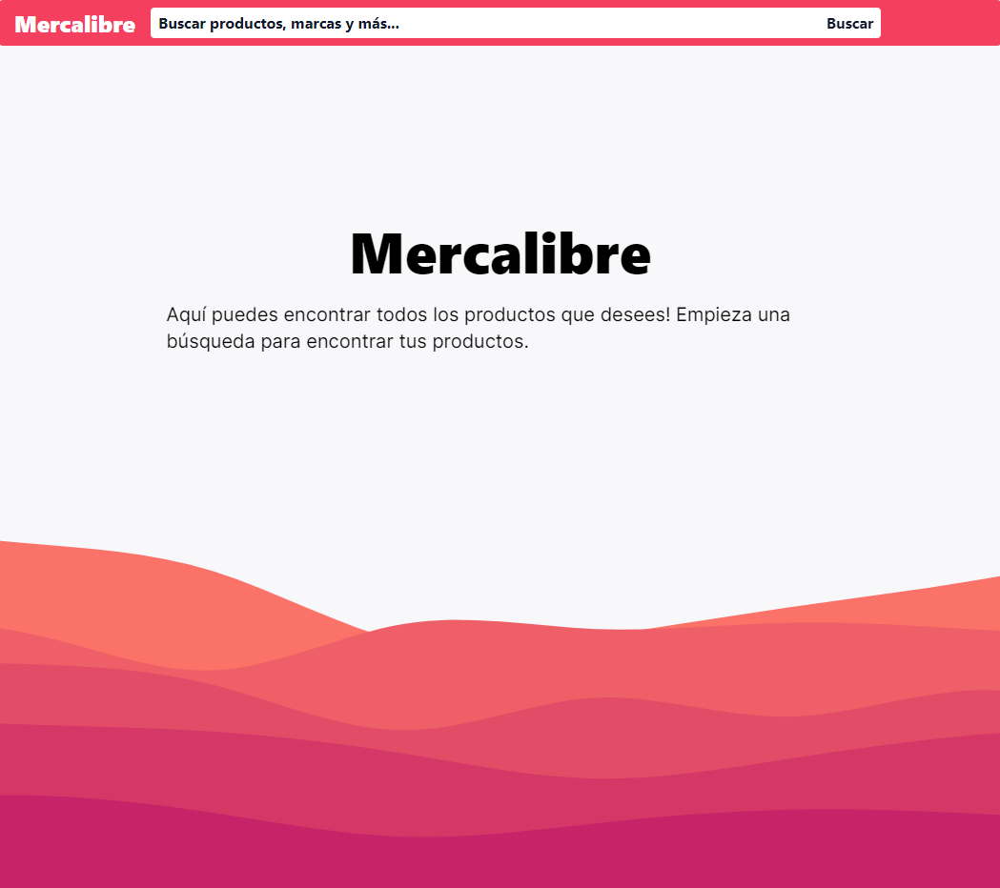
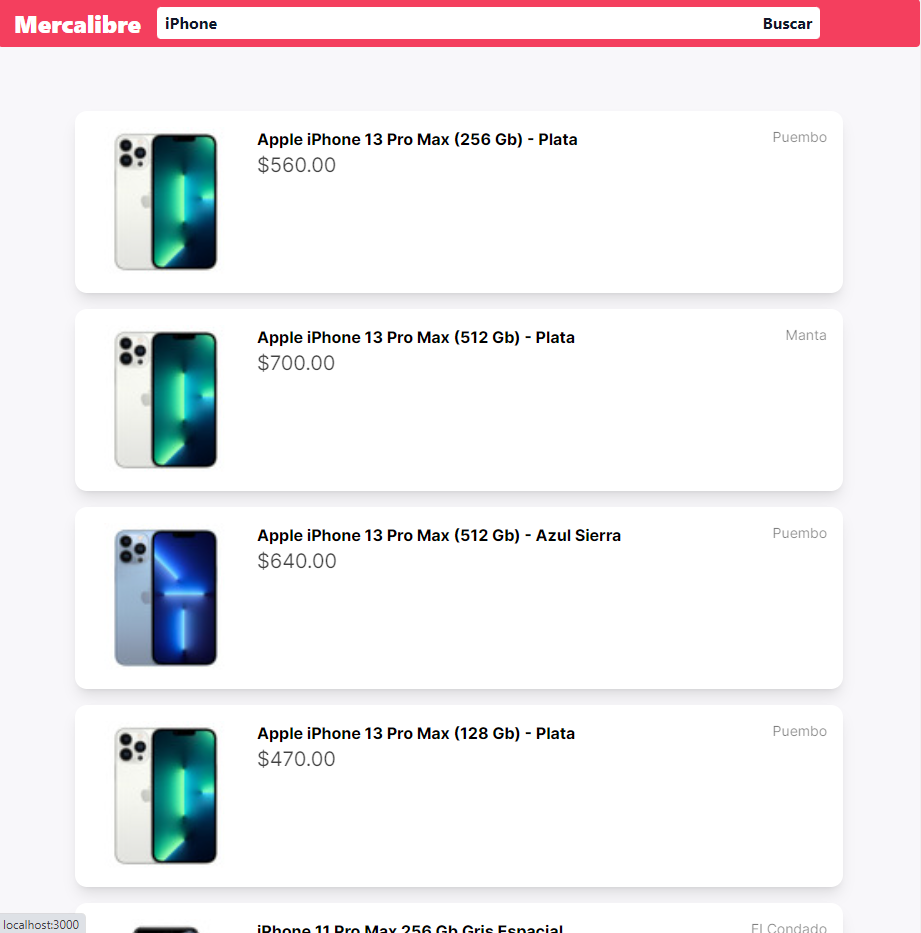
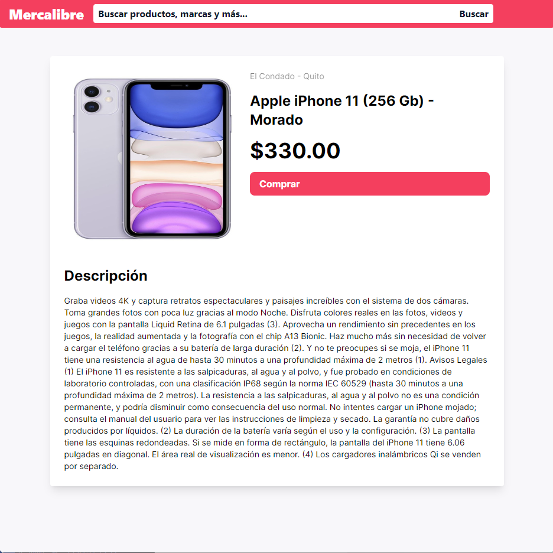

# Mercalibre 😎

Prueba técnica de Mercado Libre, en el cuál se usa la api abierta oficial de mercado libre para poder recuperar información de los productos.


## Herramientas de desarrollo

 - Next Js
- [Api Mercado libre](https://api.mercadolibre.com/sites/MEC/search?q=iphone#json)
 - Tailwind CSS
 - Typescript


## ¿Cómo levantar el proyecto?

Es sencillo, realiza un git clone del proyecto después ejecuta los siguientes comandos:

```bash
  cd ./project-folder
```

```bash
  npm install
```

```bash
  npm run dev
```


## Authors

- [@githubpopckorn](https://github.com/githubpopckorn)


## Feedback

Si tienes algun feedback o recomendación puedes encontrarme en santy_lopez@live.com.ar


## 🚀 About Me
Full stack developer...


## License

[MIT](https://choosealicense.com/licenses/mit/)


<div style="text-align:center">





</div>

